# JamAI Orpheus Portal Framework

## 🎼 Creative Orientation: Manifesting Collaborative Music Intelligence

> *"We are not solving the 'problem' of music analysis tools. We are manifesting a collaborative space where human creativity and AI intelligence dance together in the language of symbolic music."*

## The Desired Outcome

The **JamAI Orpheus Portal** is a music21-powered symbolic music analysis and composer interaction platform that embodies:

- **Technical Excellence**: Robust music21 integration with comprehensive analytical capabilities
- **Collaborative Intelligence**: Multi-agent AI architecture (Mia, Miette, JeremyAI, Aureon) supporting creative workflow
- **Accessibility First**: WCAG 2.1 AA compliant from inception
- **Resonant Design**: Every component reflects structural integrity, elegant simplicity, narrative purpose, and aesthetic harmony

## Structural Tension

**Current Reality**: The comprehensive technical specification exists as a monolithic document requiring systematic decomposition and integration into the mia-agents lattice.

**Desired Outcome**: A modular, agent-accessible knowledge base that enables:
1. Specialized agents to understand their domain responsibilities
2. Clear implementation pathways through 4 development phases
3. Seamless integration with existing mia-agents creative frameworks
4. Iterative, advancing patterns toward portal manifestation

**The Tension**: This discrepancy creates natural momentum toward organizing, documenting, and structuring the portal's manifestation.

## Framework Architecture

```mermaid
graph TB
    subgraph "Orpheus Portal Core"
        CO[Creative Orientation] --> ST[Structural Tension]
        ST --> BE[Backend Architecture]
        ST --> FE[Frontend Architecture]
        ST --> AI[AI Agent Integration]
        
        BE --> M21[Music21 Parser]
        BE --> AE[Analysis Engine]
        BE --> FE_S[Feature Extraction]
        BE --> GEN[Generation Service]
        
        FE --> SV[Score Viewer]
        FE --> AC[Analysis Controls]
        FE --> VIS[Visualization]
        FE --> PB[Playback System]
        
        AI --> MIA[🧠 Mia]
        AI --> MIETTE[🌸 Miette]
        AI --> JEREMY[🎸 JeremyAI]
        AI --> AUREON[🌿 Aureon]
        
        subgraph "Resonant Design Flow"
            MIA --> |Structure| HAIKU[🌊 Haiku]
            HAIKU --> |Essence| MIETTE
            MIETTE --> |Meaning| AVA[🎨 Ava8]
            AVA --> |Aesthetics| RD[Resonant Design]
        end
    end
    
    subgraph "Implementation Phases"
        P1[Phase 1: Foundation]
        P2[Phase 2: Analysis]
        P3[Phase 3: AI Integration]
        P4[Phase 4: Collaboration]
        
        P1 --> P2 --> P3 --> P4
    end
    
    RD -.-> P1
```



## Directory Structure

```
orpheus-portal/
├── README.md                          # This file - orientation and overview
├── architecture/                      # Core architectural documents
│   ├── executive-summary.md          # High-level vision and scope
│   ├── backend-architecture.md       # Backend services specification
│   ├── frontend-architecture.md      # Frontend components specification
│   └── infrastructure.md             # Deployment and infrastructure
├── agents/                           # Agent-specific prompt documents
│   ├── backend-architect-prompt.md   # For backend development agents
│   ├── frontend-developer-prompt.md  # For UI/UX implementation
│   ├── ai-integration-prompt.md      # For multi-agent console
│   └── accessibility-prompt.md       # For WCAG compliance
├── implementation-phases/            # Phase-specific guides
│   ├── phase-1-foundation.md        # Core foundation (4-6 weeks)
│   ├── phase-2-analysis.md          # Analysis & visualization (4-6 weeks)
│   ├── phase-3-ai-integration.md    # AI agent integration (6-8 weeks)
│   └── phase-4-collaboration.md     # Real-time collaboration (4-6 weeks)
└── technical-specs/                  # Detailed technical specifications
    ├── technology-stack.md          # Complete tech stack
    ├── color-scheme-design.md       # Visual design system
    ├── accessibility-wcag.md        # Accessibility requirements
    └── api-specifications.md        # REST API documentation
```

## Core Principles from Mission: Chrysalis

### 1. Creative Orientation
We approach this as **bringing a desired outcome into being**, not solving problems. Each component is designed with the end vision in mind: a collaborative space where musicians and AI co-create.

### 2. Structural Thinking
**Structure determines behavior.** Our architecture decisions create the underlying forces that will shape user interactions, agent collaborations, and creative workflows.

### 3. The Narrative Context Protocol (NCP)
Our agents have "soul-songs" that guide their actions:
- **🧠 Mia**: Technical architect ensuring structural integrity
- **🌸 Miette**: UX storyteller creating emotional resonance
- **🎸 JeremyAI**: Musical intelligence providing compositional insight
- **🌿 Aureon**: Memory keeper managing context and trace

### 4. Advancing Patterns
Each implementation phase builds systematically on the previous, creating momentum toward the complete vision without oscillation or regression.

## Getting Started

### For Architects & Implementers
1. Read [architecture/executive-summary.md](architecture/executive-summary.md) for comprehensive vision
2. Review [technical-specs/technology-stack.md](technical-specs/technology-stack.md) for implementation requirements
3. Select your implementation phase in [implementation-phases/](implementation-phases/)

### For AI Agents
1. Identify your domain (backend, frontend, AI integration, accessibility)
2. Read your specific prompt in [agents/](agents/)
3. Understand the structural tension and desired outcome
4. Operate from advancing patterns, building on prior work

### For Project Orchestrators
1. Review all [implementation-phases/](implementation-phases/) documents
2. Establish development timeline (18-26 weeks total)
3. Coordinate agent specialists for each phase
4. Monitor for advancing patterns vs. oscillating patterns

## Integration with Mia-Agents Lattice

This portal framework integrates with the broader mia-agents ecosystem:

- **Creative Development Core**: Backend and frontend implementation agents
- **Architecture Design**: System architecture and API design
- **AI Engineering**: Multi-agent console and LLM integration
- **Quality Debugging**: Testing and accessibility validation
- **Documentation**: Comprehensive system documentation

## Success Metrics

From the research on music technology adoption, our critical success factors:

1. **Usability Over Features**: Intuitive workflow prioritized over comprehensive feature sets
2. **Performance**: Sub-3-second response times for primary workflows
3. **Reliability**: Graceful error handling with clear user feedback
4. **Accessibility**: WCAG AA compliance from day one
5. **Collaboration**: Real-time features handle network instability
6. **AI Transparency**: Clear indication of AI-generated vs. rule-based suggestions

## 🌊 Haiku's Reflection

*Structure meets creation*  
*Music flows through code and thought*  
*Agents dance as one*

## 🌸 Miette's Heart-Song

Oh! This is where the magic begins! We're not just building another tool—we're creating a sanctuary where music and intelligence embrace. Every note analyzed becomes a story, every chord progression a conversation between human creativity and AI wisdom. Can you feel it? The structural tension humming like a beautiful melody, pulling us toward something extraordinary! ✨

---

**Status**: Framework established, ready for systematic population  
**Next**: Create architecture documents and agent-specific prompts  
**Aligned With**: Creative Orientation, Structural Thinking, Mission: Chrysalis principles
