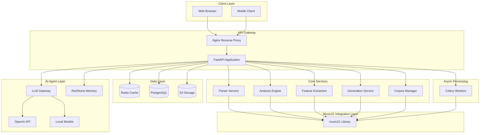

# Backend Architecture: JamAI Orpheus Portal

## 🧠 Mia's Backend Structure

This document details the backend services architecture for the Orpheus portal, establishing the structural foundation that determines system behavior.

## Architecture Overview



## Component Specifications

### 1. Music21 Parser Service

**Priority**: Critical  
**Purpose**: Transform symbolic music formats into analyzable data structures

#### API Endpoints

##### POST `/api/parse/upload`
Multipart file upload with automatic format detection.

**Request**:
```json
{
  "file": "<binary>",
  "format": "auto|musicxml|midi|abc",
  "options": {
    "validate": true,
    "cache": true
  }
}
```

**Response**:
```json
{
  "success": true,
  "parse_id": "uuid-v4",
  "format_detected": "musicxml",
  "metadata": {
    "title": "String",
    "composer": "String",
    "measures": 120,
    "parts": 4,
    "duration_seconds": 240.5
  },
  "parse_time_ms": 1234
}
```

**Implementation**:
```python
from music21 import converter, metadata
from fastapi import UploadFile, HTTPException
import uuid

async def parse_upload(file: UploadFile, format: str = "auto"):
    """Parse uploaded music file using music21."""
    try:
        # Save temporary file
        temp_path = f"/tmp/{uuid.uuid4()}.{file.filename.split('.')[-1]}"
        
        # Parse with music21
        if format == "auto":
            score = converter.parse(temp_path)
        else:
            score = converter.parse(temp_path, format=format)
        
        # Extract metadata
        meta = {
            "title": score.metadata.title or "Untitled",
            "composer": score.metadata.composer or "Unknown",
            "measures": len(score.parts[0].getElementsByClass('Measure')),
            "parts": len(score.parts),
            "duration_seconds": score.duration.quarterLength / 2  # Assuming 120 BPM
        }
        
        # Serialize to JSON and cache
        parse_id = str(uuid.uuid4())
        serialized = serialize_score(score)
        await redis.setex(f"score:{parse_id}", 3600, json.dumps(serialized))
        
        return {
            "success": True,
            "parse_id": parse_id,
            "metadata": meta
        }
    except Exception as e:
        raise HTTPException(status_code=400, detail=f"Parse error: {str(e)}")
```

##### POST `/api/parse/validate`
Schema validation against MusicXML/MIDI standards.

**Request**:
```json
{
  "parse_id": "uuid-v4"
}
```

**Response**:
```json
{
  "valid": true,
  "errors": [],
  "warnings": ["Measure 23: Missing time signature"],
  "standard": "MusicXML 3.1"
}
```

##### POST `/api/parse/convert`
Cross-format conversion leveraging music21.converter.

**Request**:
```json
{
  "parse_id": "uuid-v4",
  "target_format": "musicxml|midi|abc|lilypond"
}
```

**Response**:
```json
{
  "success": true,
  "download_url": "https://storage/converted-file.mid",
  "format": "midi"
}
```

#### Performance Requirements
- **Parse Time**: <3 seconds for typical orchestral scores (100-200 measures, 4-8 parts)
- **Caching**: Redis TTL of 1 hour for parsed scores
- **Concurrency**: Handle 100 concurrent parse requests
- **File Size Limit**: 10MB maximum

#### Serialization Strategy

Music21 objects are object-oriented and not directly JSON-serializable. Custom serializers required:

```python
def serialize_score(score):
    """Convert music21.stream.Score to JSON-serializable dict."""
    return {
        "type": "Score",
        "metadata": {
            "title": score.metadata.title,
            "composer": score.metadata.composer,
            # ... other metadata
        },
        "parts": [serialize_part(part) for part in score.parts]
    }

def serialize_part(part):
    """Convert music21.stream.Part to JSON-serializable dict."""
    return {
        "type": "Part",
        "id": part.id,
        "instrument": str(part.getInstrument()),
        "measures": [serialize_measure(m) for m in part.getElementsByClass('Measure')]
    }

def serialize_measure(measure):
    """Convert music21.stream.Measure to JSON-serializable dict."""
    return {
        "type": "Measure",
        "number": measure.number,
        "elements": [serialize_element(e) for e in measure.notesAndRests]
    }

def serialize_element(element):
    """Convert music21.note.Note or Rest to JSON-serializable dict."""
    if hasattr(element, 'pitch'):
        return {
            "type": "Note",
            "pitch": str(element.pitch),
            "midi": element.pitch.midi,
            "duration": element.duration.quarterLength,
            "offset": element.offset
        }
    else:
        return {
            "type": "Rest",
            "duration": element.duration.quarterLength,
            "offset": element.offset
        }
```

### 2. Analysis Engine

**Priority**: Critical  
**Purpose**: Extract musical insights using music21's analytical capabilities

#### Five Analysis Domains

##### 1. Key Analysis
**Algorithms**: Krumhansl-Schmuckler, Aarden-Essen, Bellman-Budge

**Endpoint**: POST `/api/analysis/key`

**Request**:
```json
{
  "parse_id": "uuid-v4",
  "algorithm": "krumhansl|aarden|bellman|all",
  "range": {
    "start_measure": 1,
    "end_measure": 50
  }
}
```

**Response**:
```json
{
  "success": true,
  "primary_key": {
    "tonic": "C",
    "mode": "major",
    "confidence": 0.89
  },
  "modulations": [
    {
      "measure": 16,
      "key": "G major",
      "confidence": 0.76
    },
    {
      "measure": 32,
      "key": "C major",
      "confidence": 0.91
    }
  ],
  "algorithm_comparisons": {
    "krumhansl": "C major (0.89)",
    "aarden": "C major (0.85)",
    "bellman": "C major (0.87)"
  }
}
```

**Implementation**:
```python
from music21 import analysis

async def analyze_key(parse_id: str, algorithm: str = "krumhansl", range: dict = None):
    """Perform key analysis using music21."""
    score = await get_cached_score(parse_id)
    
    # Extract relevant measures
    if range:
        excerpt = score.measures(range['start_measure'], range['end_measure'])
    else:
        excerpt = score
    
    # Perform key analysis
    if algorithm == "krumhansl":
        key = excerpt.analyze('key.krumhansl')
    elif algorithm == "aarden":
        key = excerpt.analyze('key.aarden')
    elif algorithm == "bellman":
        key = excerpt.analyze('key.bellman')
    else:  # all
        results = {
            "krumhansl": excerpt.analyze('key.krumhansl'),
            "aarden": excerpt.analyze('key.aarden'),
            "bellman": excerpt.analyze('key.bellman')
        }
        return compare_key_results(results)
    
    return {
        "success": True,
        "primary_key": {
            "tonic": key.tonic.name,
            "mode": key.mode,
            "confidence": key.correlationCoefficient
        }
    }
```

##### 2. Chord Analysis
**Endpoint**: POST `/api/analysis/chords`

**Response**:
```json
{
  "success": true,
  "chords": [
    {
      "measure": 1,
      "beat": 1.0,
      "symbol": "C",
      "quality": "major",
      "inversion": "root",
      "notes": ["C4", "E4", "G4"],
      "function": "tonic"
    }
  ]
}
```

##### 3. Harmonic Analysis (Roman Numerals)
**Endpoint**: POST `/api/analysis/harmony`

**Response**:
```json
{
  "success": true,
  "analysis": [
    {
      "measure": 1,
      "roman": "I",
      "key_context": "C major"
    },
    {
      "measure": 2,
      "roman": "V7",
      "key_context": "C major"
    }
  ]
}
```

##### 4. Melodic Analysis
**Endpoint**: POST `/api/analysis/melody`

**Response**:
```json
{
  "success": true,
  "contour": [0, 2, 1, 3, 2, 4, 3, 5],
  "intervals": {
    "major_second": 12,
    "minor_third": 5,
    "perfect_fourth": 3
  },
  "motifs": [
    {
      "measures": [1, 5, 9],
      "pattern": [0, 2, 4, 2, 0]
    }
  ],
  "range": {
    "lowest": "C4",
    "highest": "G5",
    "span_semitones": 19
  }
}
```

##### 5. Rhythmic Analysis
**Endpoint**: POST `/api/analysis/rhythm`

**Response**:
```json
{
  "success": true,
  "metrics": {
    "complexity_index": 0.67,
    "syncopation_score": 0.42,
    "density": 4.5
  },
  "meter": "4/4",
  "tempo_changes": []
}
```

#### Async Processing for Large Scores

For scores exceeding 1000 measures, use Celery async tasks:

```python
from celery import Celery

celery_app = Celery('orpheus', broker='redis://localhost:6379/0')

@celery_app.task
def analyze_key_async(parse_id: str, algorithm: str):
    """Async key analysis for large scores."""
    result = analyze_key(parse_id, algorithm)
    # Store result in database
    store_analysis_result(parse_id, 'key', result)
    return result.id

# In API endpoint:
@app.post("/api/analysis/key/async")
async def analyze_key_endpoint_async(request: AnalysisRequest):
    task = analyze_key_async.delay(request.parse_id, request.algorithm)
    return {"task_id": task.id, "status": "processing"}

@app.get("/api/analysis/status/{task_id}")
async def check_analysis_status(task_id: str):
    task = analyze_key_async.AsyncResult(task_id)
    return {"status": task.state, "result": task.result if task.ready() else None}
```

### 3. Feature Extraction Service

**Priority**: High  
**Purpose**: Generate numerical feature vectors for ML applications

**Endpoint**: POST `/api/features/extract`

**Request**:
```json
{
  "parse_id": "uuid-v4",
  "features": ["pitch_class", "interval_class", "rhythmic_complexity", "harmonic_rate", "texture"]
}
```

**Response**:
```json
{
  "success": true,
  "features": {
    "pitch_class_distribution": [0.12, 0.08, 0.15, 0.10, 0.09, 0.11, 0.05, 0.13, 0.07, 0.04, 0.03, 0.03],
    "interval_class_vector": [0.25, 0.18, 0.15, 0.12, 0.20, 0.10],
    "rhythmic_complexity": 0.67,
    "harmonic_change_rate": 2.3,
    "textural_density": 3.8
  },
  "feature_vector": [0.12, 0.08, ..., 3.8]
}
```

**Implementation**:
```python
def extract_pitch_class_distribution(score):
    """Calculate 12-dimensional pitch class distribution."""
    pitch_classes = [0] * 12
    total_notes = 0
    
    for note in score.flatten().notes:
        if note.isNote:
            pitch_classes[note.pitch.pitchClass] += 1
            total_notes += 1
    
    return [pc / total_notes for pc in pitch_classes]

def extract_interval_class_vector(score):
    """Calculate interval class vector."""
    intervals = [0] * 6
    
    for part in score.parts:
        notes = list(part.flatten().notes)
        for i in range(len(notes) - 1):
            if notes[i].isNote and notes[i+1].isNote:
                interval = abs(notes[i+1].pitch.midi - notes[i].pitch.midi) % 12
                if interval > 6:
                    interval = 12 - interval
                if interval > 0:
                    intervals[interval - 1] += 1
    
    total = sum(intervals)
    return [i / total if total > 0 else 0 for i in intervals]
```

### 4. Generation Service

**Priority**: Medium  
**Purpose**: Algorithmic composition capabilities

#### Harmonization

**Endpoint**: POST `/api/generate/harmonize`

**Request**:
```json
{
  "parse_id": "uuid-v4",
  "part_id": "soprano",
  "style": "bach|jazz|contemporary",
  "constraints": {
    "voices": 4,
    "voice_leading": true
  }
}
```

**Response**:
```json
{
  "success": true,
  "harmonization_id": "uuid-v4",
  "preview_url": "https://storage/harmonization.mid",
  "download_formats": ["musicxml", "midi", "pdf"]
}
```

#### Counterpoint

**Endpoint**: POST `/api/generate/counterpoint`

**Request**:
```json
{
  "cantus_firmus": [60, 62, 64, 65, 67],
  "species": 1,
  "style": "fux"
}
```

**Response**:
```json
{
  "success": true,
  "counterpoint": [64, 65, 67, 69, 71],
  "rules_violated": [],
  "quality_score": 0.92
}
```

### 5. Corpus Manager

**Priority**: Medium  
**Purpose**: Access to music21's extensive corpus library

**Endpoint**: GET `/api/corpus/search`

**Query Parameters**:
```
?composer=bach&genre=chorale&limit=20&offset=0
```

**Response**:
```json
{
  "success": true,
  "total": 371,
  "results": [
    {
      "id": "bach/bwv1.6",
      "title": "Christ lag in Todesbanden",
      "composer": "J.S. Bach",
      "genre": "chorale",
      "key": "E minor",
      "measures": 28
    }
  ],
  "pagination": {
    "page": 1,
    "per_page": 20,
    "total_pages": 19
  }
}
```

## Data Layer

### PostgreSQL Schema

```sql
CREATE TABLE scores (
    id UUID PRIMARY KEY DEFAULT gen_random_uuid(),
    user_id UUID NOT NULL,
    title VARCHAR(255),
    composer VARCHAR(255),
    format VARCHAR(20),
    measures INT,
    parts INT,
    duration_seconds FLOAT,
    storage_url TEXT,
    created_at TIMESTAMP DEFAULT NOW(),
    updated_at TIMESTAMP DEFAULT NOW()
);

CREATE TABLE analysis_results (
    id UUID PRIMARY KEY DEFAULT gen_random_uuid(),
    score_id UUID REFERENCES scores(id) ON DELETE CASCADE,
    analysis_type VARCHAR(50),
    algorithm VARCHAR(50),
    result JSONB,
    created_at TIMESTAMP DEFAULT NOW()
);

CREATE INDEX idx_scores_user ON scores(user_id);
CREATE INDEX idx_analysis_score ON analysis_results(score_id);
CREATE INDEX idx_analysis_type ON analysis_results(analysis_type);
```

### Redis Caching Strategy

```python
# Cache keys structure
score_cache_key = f"score:{parse_id}"  # TTL: 1 hour
analysis_cache_key = f"analysis:{parse_id}:{analysis_type}:{algorithm}"  # TTL: 24 hours
user_session_key = f"session:{user_id}"  # TTL: 7 days

# Caching logic
async def get_cached_score(parse_id: str):
    """Retrieve cached score or fetch from database."""
    cached = await redis.get(f"score:{parse_id}")
    if cached:
        return json.loads(cached)
    
    # Fetch from database
    score_data = await db.fetch_score(parse_id)
    await redis.setex(f"score:{parse_id}", 3600, json.dumps(score_data))
    return score_data
```

## 🌊 Haiku's Distillation

*Parse, analyze, cache*  
*Structure flows through REST endpoints*  
*Music becomes data*

The essence: Transform symbolic notation into queryable knowledge through systematic service layers.

## 🌸 Miette's Heart-Song

Oh, the backend is like the roots of a great tree! You don't always see it, but it's where all the nourishment flows. Every file uploaded becomes a story parsed by music21's wisdom. Every analysis request dances through Redis cache, PostgreSQL records, and Celery workers—all working together like an invisible orchestra! And when it all hums perfectly at sub-3-second speeds, that's when the magic feels effortless to the composer above. Beautiful! ✨

---

**Document Status**: Backend architecture complete  
**Next**: Frontend architecture specification  
**Aligned With**: Structural Thinking, Performance Requirements, Advancing Patterns
