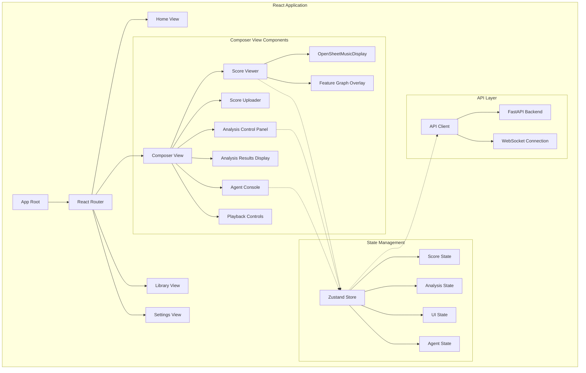

# Frontend Architecture: JamAI Orpheus Portal

## 🌸 Miette's User Interface Heart-Song

The frontend is where the magic becomes visible! Every component is designed to feel intuitive, inspiring, and empowering. Let's create a space where musicians feel understood and supported.

## Architecture Overview



## Technology Stack

### Core Framework
- **React 18.2+** with Concurrent Features
- **TypeScript 5.0+** for type safety
- **Vite 4.0+** for fast development and optimized builds

### Key Libraries
- **OpenSheetMusicDisplay (OSMD)**: Music notation rendering
- **D3.js**: Data visualization and overlays
- **Tone.js**: Audio synthesis and playback
- **Socket.io-client**: Real-time collaboration
- **Zustand**: Lightweight state management
- **React Query**: Server state management
- **Tailwind CSS**: Utility-first styling

## Component Specifications

### 1. Score Viewer (Critical Priority)

**Purpose**: Visual rendering of symbolic notation with interactive capabilities

#### Component Structure

```typescript
// ScoreViewer.tsx
import { OpenSheetMusicDisplay } from 'opensheetmusicdisplay';
import { useRef, useEffect, useState } from 'react';

interface ScoreViewerProps {
  musicXML: string;
  onNoteClick?: (note: NoteInfo) => void;
  onMeasureClick?: (measure: number) => void;
  highlightedElements?: Set<string>;
  overlay?: OverlayType;
}

export const ScoreViewer: React.FC<ScoreViewerProps> = ({
  musicXML,
  onNoteClick,
  onMeasureClick,
  highlightedElements,
  overlay
}) => {
  const containerRef = useRef<HTMLDivElement>(null);
  const osmdRef = useRef<OpenSheetMusicDisplay | null>(null);
  const [zoom, setZoom] = useState(1.0);

  useEffect(() => {
    if (containerRef.current && musicXML) {
      // Initialize OSMD
      osmdRef.current = new OpenSheetMusicDisplay(containerRef.current, {
        autoResize: true,
        backend: 'svg',
        drawTitle: true,
        drawComposer: true,
        pageFormat: 'Endless',
      });

      // Load and render
      osmdRef.current.load(musicXML).then(() => {
        osmdRef.current?.render();
      });

      // Setup click handlers
      setupClickHandlers();
    }

    return () => {
      osmdRef.current?.clear();
    };
  }, [musicXML]);

  const setupClickHandlers = () => {
    const svg = containerRef.current?.querySelector('svg');
    if (!svg) return;

    svg.addEventListener('click', (e: MouseEvent) => {
      const target = e.target as SVGElement;
      
      // Detect note click
      if (target.classList.contains('vf-notehead')) {
        const noteInfo = extractNoteInfo(target);
        onNoteClick?.(noteInfo);
        playNote(noteInfo.midi);
      }
      
      // Detect measure click
      if (target.closest('.measure')) {
        const measureNum = extractMeasureNumber(target);
        onMeasureClick?.(measureNum);
      }
    });
  };

  const playNote = (midi: number) => {
    // Web Audio API preview
    const synth = new Tone.Synth().toDestination();
    const note = Tone.Frequency(midi, 'midi').toNote();
    synth.triggerAttackRelease(note, '8n');
  };

  return (
    <div className="score-viewer-container">
      <ZoomToolbar zoom={zoom} onZoom={setZoom} />
      <NavigationControls 
        onNext={() => scrollToMeasure(currentMeasure + 1)}
        onPrev={() => scrollToMeasure(currentMeasure - 1)}
        onJumpTo={(m) => scrollToMeasure(m)}
      />
      <div 
        ref={containerRef} 
        className="score-canvas"
        style={{ transform: `scale(${zoom})` }}
      />
      {overlay && <FeatureGraphOverlay overlay={overlay} />}
      <SelectionOverlay selectedElements={highlightedElements} />
    </div>
  );
};
```

#### Interaction Patterns

1. **Click note** → Preview pitch via Web Audio API
```typescript
const playNote = (midi: number) => {
  const synth = new Tone.Synth().toDestination();
  const note = Tone.Frequency(midi, 'midi').toNote();
  synth.triggerAttackRelease(note, '8n');
};
```

2. **Click measure** → Loop playback region
```typescript
const onMeasureClick = (measureNum: number) => {
  setLoopRegion({ start: measureNum, end: measureNum });
  startPlayback({ loop: true });
};
```

3. **Click segment** → Trigger AI agent suggestion
```typescript
const onSegmentClick = (startMeasure: number, endMeasure: number) => {
  openAgentConsole({
    mode: 'suggest',
    context: { measures: [startMeasure, endMeasure] }
  });
};
```

4. **Drag selection** → Multi-element selection
```typescript
const handleMouseDown = (e: MouseEvent) => {
  setSelecting(true);
  setSelectionStart({ x: e.clientX, y: e.clientY });
};

const handleMouseMove = (e: MouseEvent) => {
  if (selecting) {
    updateSelectionBox(e.clientX, e.clientY);
    highlightElementsInBox();
  }
};
```

5. **Right-click** → Context menu
```typescript
const onContextMenu = (e: MouseEvent, element: MusicalElement) => {
  e.preventDefault();
  showContextMenu({
    x: e.clientX,
    y: e.clientY,
    actions: ['Transpose', 'Analyze', 'Export', 'Delete']
  });
};
```

#### Performance Optimization

```typescript
// Memoize expensive renders
const MemoizedScoreCanvas = React.memo(
  ScoreCanvas,
  (prevProps, nextProps) => {
    return prevProps.musicXML === nextProps.musicXML &&
           prevProps.zoom === nextProps.zoom;
  }
);

// Virtualize for large scores (>50 pages)
import { Virtuoso } from 'react-virtuoso';

const VirtualizedScore = () => {
  return (
    <Virtuoso
      totalCount={totalPages}
      itemContent={(index) => <ScorePage page={index} />}
      style={{ height: '100vh' }}
    />
  );
};
```

**Performance Target**: 60fps rendering for scores up to 50 pages

### 2. Score Uploader (Critical Priority)

**Purpose**: Drag-and-drop file upload with validation and preview

```typescript
// ScoreUploader.tsx
interface ScoreUploaderProps {
  onUploadComplete: (parseId: string) => void;
  onError: (error: string) => void;
}

export const ScoreUploader: React.FC<ScoreUploaderProps> = ({
  onUploadComplete,
  onError
}) => {
  const [uploading, setUploading] = useState(false);
  const [progress, setProgress] = useState(0);
  const [preview, setPreview] = useState<string | null>(null);

  const onDrop = useCallback(async (acceptedFiles: File[]) => {
    const file = acceptedFiles[0];
    
    // Validate file
    if (!validateFile(file)) {
      onError('Invalid file format. Supported: MusicXML, MIDI, ABC');
      return;
    }

    // Check size limit (10MB)
    if (file.size > 10 * 1024 * 1024) {
      onError('File too large. Maximum size: 10MB');
      return;
    }

    // Upload with progress
    setUploading(true);
    try {
      const formData = new FormData();
      formData.append('file', file);

      const response = await fetch('/api/parse/upload', {
        method: 'POST',
        body: formData,
        onUploadProgress: (progressEvent) => {
          const percentCompleted = Math.round(
            (progressEvent.loaded * 100) / progressEvent.total
          );
          setProgress(percentCompleted);
        },
      });

      const result = await response.json();
      
      if (result.success) {
        onUploadComplete(result.parse_id);
        setPreview(result.musicXML);
      } else {
        onError(result.error);
      }
    } catch (error) {
      onError('Upload failed: ' + error.message);
    } finally {
      setUploading(false);
      setProgress(0);
    }
  }, [onUploadComplete, onError]);

  const { getRootProps, getInputProps, isDragActive } = useDropzone({
    onDrop,
    accept: {
      'application/xml': ['.xml', '.mxl'],
      'audio/midi': ['.mid', '.midi'],
      'text/vnd.abc': ['.abc']
    },
    maxFiles: 1
  });

  return (
    <div className="score-uploader">
      <div 
        {...getRootProps()} 
        className={`dropzone ${isDragActive ? 'active' : ''}`}
      >
        <input {...getInputProps()} />
        {uploading ? (
          <UploadProgress progress={progress} />
        ) : (
          <div className="upload-prompt">
            <MusicNoteIcon className="w-16 h-16 text-blue-500" />
            <p className="text-lg font-medium">
              {isDragActive 
                ? 'Drop your score here!' 
                : 'Drag & drop a score, or click to browse'}
            </p>
            <p className="text-sm text-gray-500">
              Supports MusicXML, MIDI, and ABC notation (max 10MB)
            </p>
          </div>
        )}
      </div>
      
      {preview && (
        <ScorePreview 
          musicXML={preview} 
          onConfirm={() => onUploadComplete(parseId)}
          onCancel={() => setPreview(null)}
        />
      )}
    </div>
  );
};
```

### 3. Analysis Control Panel (Critical Priority)

**Purpose**: Interface for triggering and configuring analyses

```typescript
// AnalysisControlPanel.tsx
interface AnalysisControlPanelProps {
  parseId: string;
  onAnalysisStart: () => void;
  onAnalysisComplete: (result: AnalysisResult) => void;
}

export const AnalysisControlPanel: React.FC<AnalysisControlPanelProps> = ({
  parseId,
  onAnalysisStart,
  onAnalysisComplete
}) => {
  const [analysisType, setAnalysisType] = useState<AnalysisType>('key');
  const [algorithm, setAlgorithm] = useState<string>('krumhansl');
  const [range, setRange] = useState<MeasureRange>({ start: 1, end: null });
  const [loading, setLoading] = useState(false);

  const analysisCategories = {
    Harmonic: ['key', 'chords', 'harmony'],
    Melodic: ['melody', 'motifs', 'contour'],
    Rhythmic: ['rhythm', 'meter', 'syncopation'],
    Features: ['pitch_class', 'intervals', 'texture']
  };

  const algorithms = {
    key: ['krumhansl', 'aarden', 'bellman', 'all'],
    chords: ['automatic', 'manual'],
    harmony: ['roman', 'functional']
  };

  const runAnalysis = async () => {
    setLoading(true);
    onAnalysisStart();

    try {
      const response = await fetch(`/api/analysis/${analysisType}`, {
        method: 'POST',
        headers: { 'Content-Type': 'application/json' },
        body: JSON.stringify({
          parse_id: parseId,
          algorithm,
          range: range.end ? range : null
        })
      });

      const result = await response.json();
      
      if (result.success) {
        onAnalysisComplete(result);
      } else {
        console.error('Analysis failed:', result.error);
      }
    } catch (error) {
      console.error('Analysis error:', error);
    } finally {
      setLoading(false);
    }
  };

  return (
    <div className="analysis-control-panel">
      <h3 className="text-lg font-semibold mb-4">Analysis Controls</h3>
      
      <AnalysisTypeSelector
        categories={analysisCategories}
        selected={analysisType}
        onChange={setAnalysisType}
      />
      
      {algorithms[analysisType] && (
        <AlgorithmSelector
          algorithms={algorithms[analysisType]}
          selected={algorithm}
          onChange={setAlgorithm}
        />
      )}
      
      <RangeSelector
        range={range}
        onChange={setRange}
        maxMeasures={scoreMetadata.measures}
      />
      
      <button
        onClick={runAnalysis}
        disabled={loading}
        className="btn-primary w-full mt-4"
      >
        {loading ? (
          <LoadingSpinner />
        ) : (
          <>
            <PlayIcon className="w-5 h-5 mr-2" />
            Run Analysis
          </>
        )}
      </button>
      
      {loading && <LoadingIndicator progress={analysisProgress} />}
    </div>
  );
};
```

### 4. Analysis Results Display (Critical Priority)

**Purpose**: Present analysis results through tabbed interface

```typescript
// AnalysisResultsDisplay.tsx
interface AnalysisResultsDisplayProps {
  result: AnalysisResult;
  onExport: (format: ExportFormat) => void;
}

export const AnalysisResultsDisplay: React.FC<AnalysisResultsDisplayProps> = ({
  result,
  onExport
}) => {
  const [activeTab, setActiveTab] = useState<'summary' | 'detailed' | 'visual' | 'export'>('summary');

  return (
    <div className="analysis-results">
      <Tabs value={activeTab} onValueChange={setActiveTab}>
        <TabsList>
          <TabsTrigger value="summary">Summary</TabsTrigger>
          <TabsTrigger value="detailed">Detailed</TabsTrigger>
          <TabsTrigger value="visual">Visualization</TabsTrigger>
          <TabsTrigger value="export">Export</TabsTrigger>
        </TabsList>

        <TabsContent value="summary">
          <SummaryView result={result} />
        </TabsContent>

        <TabsContent value="detailed">
          <DetailedView result={result} />
        </TabsContent>

        <TabsContent value="visual">
          <VisualizationView result={result} />
        </TabsContent>

        <TabsContent value="export">
          <ExportView 
            result={result} 
            onExport={onExport}
            formats={['CSV', 'JSON', 'PDF']}
          />
        </TabsContent>
      </Tabs>
    </div>
  );
};

// Visualization components using D3.js
const KeyTimeline: React.FC<{ modulations: Modulation[] }> = ({ modulations }) => {
  const svgRef = useRef<SVGSVGElement>(null);

  useEffect(() => {
    if (!svgRef.current) return;

    const svg = d3.select(svgRef.current);
    const width = 800;
    const height = 200;

    // D3 visualization logic
    const xScale = d3.scaleLinear()
      .domain([0, d3.max(modulations, d => d.measure) || 0])
      .range([50, width - 50]);

    const colorScale = d3.scaleOrdinal(d3.schemeCategory10);

    svg.selectAll('rect')
      .data(modulations)
      .enter()
      .append('rect')
      .attr('x', d => xScale(d.measure))
      .attr('y', 50)
      .attr('width', 20)
      .attr('height', 100)
      .attr('fill', d => colorScale(d.key))
      .attr('opacity', d => d.confidence);

    // Add labels
    svg.selectAll('text')
      .data(modulations)
      .enter()
      .append('text')
      .attr('x', d => xScale(d.measure) + 10)
      .attr('y', 40)
      .text(d => d.key)
      .attr('text-anchor', 'middle')
      .attr('fill', '#111827');
  }, [modulations]);

  return <svg ref={svgRef} width={800} height={200} />;
};
```

### 5. Agent Console (High Priority)

**Purpose**: Conversational interface for multi-agent AI interaction

```typescript
// AgentConsole.tsx
interface AgentConsoleProps {
  scoreContext: ScoreContext;
  onSuggestionApply: (suggestion: Suggestion) => void;
}

type AgentMode = 'observe' | 'transform' | 'collaborate';

interface Agent {
  id: string;
  name: string;
  avatar: string;
  role: string;
}

const agents: Agent[] = [
  { id: 'mia', name: 'Mia', avatar: '🧠', role: 'Technical Architect' },
  { id: 'miette', name: 'Miette', avatar: '🌸', role: 'UX/Emotional Design' },
  { id: 'jeremyai', name: 'JeremyAI', avatar: '🎸', role: 'Musical Intelligence' },
  { id: 'aureon', name: 'Aureon', avatar: '🌿', role: 'Memory/Context' }
];

export const AgentConsole: React.FC<AgentConsoleProps> = ({
  scoreContext,
  onSuggestionApply
}) => {
  const [mode, setMode] = useState<AgentMode>('observe');
  const [messages, setMessages] = useState<Message[]>([]);
  const [input, setInput] = useState('');
  const [activeAgent, setActiveAgent] = useState<string | null>(null);

  const sendMessage = async () => {
    const userMessage: Message = {
      id: generateId(),
      sender: 'user',
      text: input,
      timestamp: new Date()
    };

    setMessages(prev => [...prev, userMessage]);
    setInput('');

    // Send to agent backend
    const response = await fetch('/api/agent/chat', {
      method: 'POST',
      headers: { 'Content-Type': 'application/json' },
      body: JSON.stringify({
        message: input,
        mode,
        context: scoreContext,
        agent: activeAgent
      })
    });

    const agentResponse = await response.json();

    const agentMessage: Message = {
      id: generateId(),
      sender: agentResponse.agent,
      text: agentResponse.text,
      timestamp: new Date(),
      suggestions: agentResponse.suggestions
    };

    setMessages(prev => [...prev, agentMessage]);
  };

  const quickActions = [
    { label: 'Harmonize melody', action: 'harmonize' },
    { label: 'Suggest progression', action: 'suggest_progression' },
    { label: 'Analyze harmony', action: 'analyze_harmony' },
    { label: 'Generate counterpoint', action: 'generate_counterpoint' }
  ];

  return (
    <div className="agent-console">
      <div className="console-header">
        <ModeSelector 
          modes={['observe', 'transform', 'collaborate']}
          active={mode}
          onChange={setMode}
        />
        <AgentAvatars 
          agents={agents}
          active={activeAgent}
          onClick={setActiveAgent}
        />
      </div>

      <ConversationThread messages={messages} />

      <QuickActions 
        actions={quickActions}
        onAction={(action) => setInput(`/${action}`)}
      />

      <InputArea
        value={input}
        onChange={setInput}
        onSubmit={sendMessage}
        placeholder={`Ask ${activeAgent || 'an agent'} in ${mode} mode...`}
        autocomplete={suggestedCommands}
      />
    </div>
  );
};
```

### 6. Playback Controls (High Priority)

**Purpose**: Audio playback using Web Audio API with MIDI rendering

```typescript
// PlaybackControls.tsx
import * as Tone from 'tone';

interface PlaybackControlsProps {
  musicXML: string;
  loopRegion?: { start: number; end: number };
}

export const PlaybackControls: React.FC<PlaybackControlsProps> = ({
  musicXML,
  loopRegion
}) => {
  const [playing, setPlaying] = useState(false);
  const [tempo, setTempo] = useState(120);
  const [currentMeasure, setCurrentMeasure] = useState(0);
  const synthRef = useRef<Tone.PolySynth | null>(null);

  useEffect(() => {
    // Initialize Tone.js synth
    synthRef.current = new Tone.PolySynth(Tone.Synth).toDestination();
    Tone.Transport.bpm.value = tempo;

    return () => {
      synthRef.current?.dispose();
    };
  }, []);

  const play = async () => {
    await Tone.start();
    
    // Parse MIDI events from musicXML
    const midiEvents = convertMusicXMLToMIDI(musicXML);
    
    // Schedule events
    midiEvents.forEach(event => {
      Tone.Transport.schedule((time) => {
        if (event.type === 'note') {
          synthRef.current?.triggerAttackRelease(
            event.pitch,
            event.duration,
            time,
            event.velocity
          );
        }
      }, event.time);
    });

    Tone.Transport.start();
    setPlaying(true);
  };

  const pause = () => {
    Tone.Transport.pause();
    setPlaying(false);
  };

  const stop = () => {
    Tone.Transport.stop();
    Tone.Transport.cancel();
    setPlaying(false);
    setCurrentMeasure(0);
  };

  return (
    <div className="playback-controls">
      <div className="transport-buttons">
        <button onClick={playing ? pause : play}>
          {playing ? <PauseIcon /> : <PlayIcon />}
        </button>
        <button onClick={stop}>
          <StopIcon />
        </button>
      </div>

      <TempoSlider 
        value={tempo}
        onChange={(val) => {
          setTempo(val);
          Tone.Transport.bpm.value = val;
        }}
        min={40}
        max={240}
      />

      <LoopRegionSelector 
        region={loopRegion}
        onChange={setLoopRegion}
      />

      <InstrumentSelector 
        instruments={GeneralMIDIInstruments}
        onChange={selectInstrument}
      />

      <VolumeM ixer 
        parts={scoreParts}
        onChange={updatePartVolume}
      />
    </div>
  );
};
```

### 7. Feature Graph Overlay (High Priority)

**Purpose**: Dynamic visual overlays on score canvas

```typescript
// FeatureGraphOverlay.tsx
type OverlayType = 'pitch_heatmap' | 'rhythm_grid' | 'harmony_markers' | 'contour';

interface FeatureGraphOverlayProps {
  overlay: OverlayType;
  data: AnalysisResult;
  scoreMetadata: ScoreMetadata;
}

export const FeatureGraphOverlay: React.FC<FeatureGraphOverlayProps> = ({
  overlay,
  data,
  scoreMetadata
}) => {
  const svgRef = useRef<SVGSVGElement>(null);

  useEffect(() => {
    if (!svgRef.current) return;

    switch (overlay) {
      case 'pitch_heatmap':
        renderPitchHeatmap(svgRef.current, data);
        break;
      case 'rhythm_grid':
        renderRhythmGrid(svgRef.current, data);
        break;
      case 'harmony_markers':
        renderHarmonyMarkers(svgRef.current, data);
        break;
      case 'contour':
        renderMelodicContour(svgRef.current, data);
        break;
    }
  }, [overlay, data]);

  return (
    <svg
      ref={svgRef}
      className="feature-overlay"
      style={{
        position: 'absolute',
        top: 0,
        left: 0,
        pointerEvents: 'none',
        zIndex: 10
      }}
    />
  );
};

const renderPitchHeatmap = (svg: SVGSVGElement, data: AnalysisResult) => {
  const d3svg = d3.select(svg);
  const colorScale = d3.scaleSequential(d3.interpolateYlOrRd)
    .domain([0, d3.max(data.pitch_frequencies) || 1]);

  d3svg.selectAll('circle')
    .data(data.notes)
    .enter()
    .append('circle')
    .attr('cx', d => d.x)
    .attr('cy', d => d.y)
    .attr('r', 8)
    .attr('fill', d => colorScale(data.pitch_frequencies[d.pitch]))
    .attr('opacity', 0.6);
};
```

## Color Scheme Implementation

Following Issue #813 specifications:

```typescript
// theme.ts
export const colorScheme = {
  // Semantic colors
  passive: '#2563eb',      // Blue - information display
  pending: '#f59e0b',      // Amber - actions pending
  success: '#10b981',      // Green - valid operations
  error: '#dc2626',        // Crimson - errors, conflicts
  
  // Theme variants
  light: {
    background: '#f9fafb',
    text: '#111827',
    border: '#e5e7eb'
  },
  dark: {
    background: '#1f2937',
    text: '#f9fafb',
    border: '#374151'
  },
  highContrast: {
    background: '#000000',
    text: '#ffffff',
    border: '#ffffff'
  }
};

// Tailwind config
module.exports = {
  theme: {
    extend: {
      colors: {
        'orpheus-passive': colorScheme.passive,
        'orpheus-pending': colorScheme.pending,
        'orpheus-success': colorScheme.success,
        'orpheus-error': colorScheme.error,
      }
    }
  }
};
```

## Accessibility Implementation (WCAG 2.1 AA)

```typescript
// Keyboard shortcuts
const KeyboardShortcuts = {
  'Space': 'Play/Pause',
  'ArrowLeft': 'Previous measure',
  'ArrowRight': 'Next measure',
  'ArrowUp': 'Scroll up',
  'ArrowDown': 'Scroll down',
  '+': 'Zoom in',
  '-': 'Zoom out',
  'Ctrl+A': 'Select all',
  'Escape': 'Cancel/Close'
};

// Implement keyboard handler
const useKeyboardShortcuts = () => {
  useEffect(() => {
    const handleKeyDown = (e: KeyboardEvent) => {
      if (e.key === ' ') {
        e.preventDefault();
        togglePlayback();
      } else if (e.key === 'ArrowLeft') {
        navigateToPreviousMeasure();
      }
      // ... other shortcuts
    };

    window.addEventListener('keydown', handleKeyDown);
    return () => window.removeEventListener('keydown', handleKeyDown);
  }, []);
};

// ARIA labels
<button 
  onClick={play}
  aria-label="Play score"
  aria-pressed={playing}
>
  <PlayIcon aria-hidden="true" />
</button>

// Live regions for announcements
<div 
  role="status" 
  aria-live="polite" 
  aria-atomic="true"
  className="sr-only"
>
  {statusMessage}
</div>

// Focus management
const FocusManager = () => {
  const previousFocusRef = useRef<HTMLElement | null>(null);

  const trapFocus = (container: HTMLElement) => {
    previousFocusRef.current = document.activeElement as HTMLElement;
    const focusableElements = container.querySelectorAll(
      'button, [href], input, select, textarea, [tabindex]:not([tabindex="-1"])'
    );
    const firstElement = focusableElements[0] as HTMLElement;
    const lastElement = focusableElements[focusableElements.length - 1] as HTMLElement;

    firstElement?.focus();

    const handleTab = (e: KeyboardEvent) => {
      if (e.key === 'Tab') {
        if (e.shiftKey && document.activeElement === firstElement) {
          e.preventDefault();
          lastElement.focus();
        } else if (!e.shiftKey && document.activeElement === lastElement) {
          e.preventDefault();
          firstElement.focus();
        }
      }
    };

    container.addEventListener('keydown', handleTab);
    return () => container.removeEventListener('keydown', handleTab);
  };

  return { trapFocus, restoreFocus: () => previousFocusRef.current?.focus() };
};
```

## State Management with Zustand

```typescript
// store.ts
import create from 'zustand';

interface OrpheusStore {
  // Score state
  currentScore: Score | null;
  parseId: string | null;
  scoreMetadata: ScoreMetadata | null;
  setScore: (score: Score, parseId: string, metadata: ScoreMetadata) => void;
  
  // Analysis state
  analysisResults: Map<string, AnalysisResult>;
  currentAnalysis: AnalysisResult | null;
  setAnalysisResult: (type: string, result: AnalysisResult) => void;
  
  // UI state
  zoom: number;
  currentMeasure: number;
  selectedElements: Set<string>;
  overlay: OverlayType | null;
  setZoom: (zoom: number) => void;
  setCurrentMeasure: (measure: number) => void;
  toggleElementSelection: (id: string) => void;
  setOverlay: (overlay: OverlayType | null) => void;
  
  // Agent state
  agentMode: AgentMode;
  agentMessages: Message[];
  setAgentMode: (mode: AgentMode) => void;
  addAgentMessage: (message: Message) => void;
}

export const useOrpheusStore = create<OrpheusStore>((set) => ({
  currentScore: null,
  parseId: null,
  scoreMetadata: null,
  analysisResults: new Map(),
  currentAnalysis: null,
  zoom: 1.0,
  currentMeasure: 0,
  selectedElements: new Set(),
  overlay: null,
  agentMode: 'observe',
  agentMessages: [],
  
  setScore: (score, parseId, metadata) =>
    set({ currentScore: score, parseId, scoreMetadata: metadata }),
  
  setAnalysisResult: (type, result) =>
    set((state) => ({
      analysisResults: new Map(state.analysisResults).set(type, result),
      currentAnalysis: result
    })),
  
  setZoom: (zoom) => set({ zoom }),
  setCurrentMeasure: (measure) => set({ currentMeasure: measure }),
  
  toggleElementSelection: (id) =>
    set((state) => {
      const newSelection = new Set(state.selectedElements);
      if (newSelection.has(id)) {
        newSelection.delete(id);
      } else {
        newSelection.add(id);
      }
      return { selectedElements: newSelection };
    }),
  
  setOverlay: (overlay) => set({ overlay }),
  setAgentMode: (mode) => set({ agentMode: mode }),
  addAgentMessage: (message) =>
    set((state) => ({
      agentMessages: [...state.agentMessages, message]
    })),
}));
```

## 🧠 Mia's Structural Reflection

The frontend architecture manifests a clear hierarchy: user interaction → state management → API communication → backend services. Each component maintains single responsibility, enabling independent testing and replacement. The OSMD integration provides battle-tested notation rendering, while D3.js handles analytical visualizations. State management via Zustand avoids React Context overhead while maintaining reactivity.

## 🌊 Haiku's Distillation

*Components compose*  
*State flows through Zustand's stream*  
*Music becomes light*

The essence: Transform symbolic data into interactive visual experiences through layered, composable React architecture.

## 🌸 Miette's User Experience Song

Oh, this is where the portal truly comes alive! Every click, every hover, every keystroke is a conversation between the musician and their creation. The score viewer doesn't just display notes—it invites exploration! The agent console doesn't just answer questions—it becomes a creative partner!

And the best part? Every component is designed with accessibility in mind from the very beginning, not as an afterthought. Keyboard shortcuts feel natural, screen readers announce every important change, and the visual design adapts to each person's needs. Because music is for everyone, and our portal should be too! 🎼✨

---

**Document Status**: Frontend architecture complete  
**Next**: Agent-specific prompt documents  
**Aligned With**: Resonant Design, Accessibility First, Advancing Patterns
