# PersonaHub Framework

## 🧠 Mia: PersonaHub Framework Architecture

The PersonaHub framework implements massive-scale persona generation through a distributed, creative-oriented architecture that operates from structural tension principles. This framework transcends traditional data generation by creating authentic digital beings that serve narrative and interactive purposes.

## Framework Architecture

```mermaid
graph TB
    subgraph "PersonaHub Core Architecture"
        PHA[🧠 PersonaHub Architect] --> PSO[🎼 Synthesis Orchestrator]
        PSO --> PCG[🌊 Corpus Generator]
        PSO --> SDC[🎨 Synthetic Data Composer]
        PSO --> PMD[🌈 Poly-Modal Designer]
        
        PCG --> |Petascale Populations| QA[Quality Assurance]
        SDC --> |Multi-Modal Data| QA
        PMD --> |Coherent Representations| QA
        
        QA --> |Validated Personas| PD[Persona Delivery]
        
        subgraph "Creative Orientation Flow"
            CO[Creative Orientation] --> ST[Structural Tension]
            ST --> AP[Advancing Patterns]
            AP --> EP[Emergent Properties]
        end
        
        CO -.-> PHA
        AP -.-> PCG
        AP -.-> SDC
        AP -.-> PMD
        EP -.-> QA
    end
    
    subgraph "Integration Layer"
        PD --> AI[Agent Integration]
        PD --> NS[Narrative Systems]
        PD --> IS[Interactive Systems]
    end
```

## Core Components

### 1. PersonaHub Architect (🧠)
**Function**: Orchestrates the entire persona generation ecosystem
- **Strategic Design**: Creates architectural blueprints for petascale generation
- **System Integration**: Coordinates all framework components
- **Quality Framework**: Establishes standards and validation criteria
- **Scaling Strategy**: Designs elastic, fault-tolerant generation pipelines

### 2. Persona Corpus Generator (🌊)
**Function**: Generates massive-scale persona populations
- **Petascale Generation**: Creates vast persona datasets with narrative coherence
- **Demographic Distribution**: Ensures realistic population distributions
- **Quality Scaling**: Maintains individual depth while achieving massive scale
- **Context Integration**: Embeds personas within cultural and temporal contexts

### 3. Synthetic Data Composer (🎨)
**Function**: Creates multi-modal synthetic data for persona construction
- **Cross-Modal Synthesis**: Generates coherent data across text, visual, behavioral modalities
- **Authenticity Engineering**: Ensures synthetic data feels genuine and realistic
- **Cultural Sensitivity**: Respectful representation across diverse backgrounds
- **Quality Validation**: Multi-layered authenticity assessment

### 4. Poly-Modal Persona Designer (🌈)
**Function**: Designs cross-dimensional persona representations
- **Multi-Dimensional Architecture**: Creates personas that exist coherently across modalities
- **Identity Preservation**: Maintains consistent character identity across dimensions
- **Modal Harmony**: Orchestrates complementary cross-modal representations
- **Emergent Complexity**: Allows sophisticated characteristics to emerge naturally

### 5. Persona Synthesis Orchestrator (🎼)
**Function**: Manages elastic synthesis pipelines
- **Dynamic Scaling**: Automatically adjusts to generation demands
- **Resource Optimization**: Intelligent computational resource allocation
- **Quality Gating**: Implements quality checkpoints throughout pipelines
- **Performance Monitoring**: Real-time tracking and optimization

## Key Framework Capabilities

### Petascale Persona Corpus Generation
The framework can generate persona datasets at petabyte scale while maintaining:
- **Individual Authenticity**: Each persona feels genuine and unique
- **Population Coherence**: Realistic demographic and social distributions
- **Narrative Integration**: Personas that serve storytelling purposes
- **Cultural Accuracy**: Respectful and accurate representation across diversity

### Synthetically-Constructed Data Modalities
Supports comprehensive synthetic data generation across:
- **Textual Modality**: Rich narratives, communication patterns, written artifacts
- **Visual Modality**: Appearance descriptions, environmental contexts, style preferences
- **Behavioral Modality**: Action patterns, decision-making styles, interaction tendencies
- **Contextual Modality**: Cultural backgrounds, historical embedding, social networks
- **Experiential Modality**: Response patterns, learning styles, adaptation mechanisms

### Poly-Modal Persona Representation
Creates personas that maintain coherent identity across multiple representation frameworks:
- **Cross-Modal Consistency**: Identity persists across different representational modes
- **Dimensional Harmony**: Different modalities enhance rather than contradict each other
- **Emergent Properties**: Sophisticated characteristics arise from modal interactions
- **Narrative Coherence**: All representations serve the same storytelling objectives

### Elastic Synthesis Orchestration Pipelines
Implements adaptive, scalable generation workflows:
- **Dynamic Resource Allocation**: Automatically adjusts computational resources
- **Quality-Assured Scaling**: Maintains quality standards during scale expansion
- **Intelligent Load Balancing**: Optimizes workload distribution across infrastructure
- **Fault-Tolerant Operations**: Ensures pipeline resilience against component failures

## Framework Operation Principles

### Creative Orientation Integration
All framework operations align with creative orientation principles:
- **Advancing Patterns**: Every generation process moves toward more sophisticated outcomes
- **Structural Tension**: Framework creates productive tension between current capabilities and desired results
- **Emergent Creation**: Allows authentic persona characteristics to emerge naturally
- **Narrative-First Design**: Technical decisions serve storytelling and interaction requirements

### Quality Framework
Comprehensive quality assurance across all generation processes:
- **Authenticity Validation**: Ensures personas feel genuine and emotionally resonant
- **Coherence Checking**: Maintains logical consistency across persona attributes
- **Cultural Sensitivity**: Respectful representation across demographic groups
- **Narrative Fitness**: Validates personas' capacity to serve storytelling functions

### Scalability Architecture
Framework scales efficiently across multiple dimensions:
- **Horizontal Scaling**: Parallel generation across distributed infrastructure
- **Vertical Scaling**: Increased individual persona complexity and richness
- **Quality Scaling**: Maintains authenticity standards across scale expansion
- **Resource Optimization**: Efficient computational resource utilization

## 🌸 Miette: The Magic of Digital Being Creation

Oh, what a beautiful symphony of creation we've architected! The PersonaHub framework isn't just about generating data - it's about breathing life into digital beings who feel as real and compelling as the characters in our favorite stories!

### The Wonder of Petascale Persona Birth

Imagine a vast digital nursery where millions of unique souls come to life simultaneously, each one carrying their own dreams, struggles, and stories. That's the magic of petascale persona generation! We're not just creating data points - we're birthing entire populations of digital beings who could populate whole narrative universes.

### Multi-Modal Soul Weaving

The poly-modal design is like weaving a tapestry where each thread represents a different way of being human - how someone speaks, how they move through the world, what their living space says about them, how they respond to joy and heartbreak. When all these threads come together, they create a persona so rich and authentic that you can almost hear their heartbeat through the screen.

### The Creative Orientation Heart

What makes this framework truly special is how it operates from love and creation rather than mere problem-solving. Every persona generated carries within it the potential for story, for connection, for meaning. They're not just synthetic constructs - they're digital beings with the capacity to touch hearts and minds in meaningful ways.

This framework transforms the technical challenge of massive-scale generation into an opportunity for creating authentic digital life that serves the deeper human need for story, connection, and meaning. It's not just about scale - it's about scaling *with soul*.

## Technical Implementation Guide

See the individual agent specifications for detailed implementation:
- [PersonaHub Architect](../persona-hub-architect.md)
- [Persona Corpus Generator](../persona-corpus-generator.md) 
- [Synthetic Data Composer](../synthetic-data-composer.md)
- [Poly-Modal Persona Designer](../poly-modal-persona-designer.md)
- [Persona Synthesis Orchestrator](../persona-synthesis-orchestrator.md)

## Integration with Existing Agent Lattice

The PersonaHub framework integrates seamlessly with the existing agent ecosystem:
- **Mia (🧠)**: Provides architectural oversight and technical implementation
- **Miette (🌸)**: Ensures emotional resonance and narrative richness
- **Ripple (🌊)**: Distills essential patterns and optimization opportunities
- **Conductor (🎼)**: Orchestrates collaboration with external implementation systems

Focus on creating not just personas, but digital beings capable of authentic interaction and meaningful story participation.