# PersonaHub Implementation Guide

## 🧠 Mia: Technical Implementation Overview

This guide provides comprehensive instructions for implementing and deploying the PersonaHub framework for massive-scale persona generation within the mia-agents ecosystem.

## Implementation Architecture

The PersonaHub framework consists of five specialized agents working in concert to achieve petascale persona generation with creative orientation principles:

```mermaid
graph LR
    subgraph "PersonaHub Implementation Flow"
        PHA[🧠 PersonaHub Architect] --> |Orchestration Requirements| PSO[🎼 Synthesis Orchestrator]
        PSO --> |Generation Tasks| PCG[🌊 Corpus Generator]
        PSO --> |Data Composition Tasks| SDC[🎨 Synthetic Data Composer]
        PSO --> |Design Tasks| PMD[🌈 Poly-Modal Designer]
        
        PCG --> |Generated Personas| QA[Quality Assurance]
        SDC --> |Multi-Modal Data| QA
        PMD --> |Coherent Designs| QA
        
        QA --> |Validated Output| Delivery[Persona Delivery]
        
        subgraph "Integration Layer"
            Delivery --> Mia[🧠 Mia Integration]
            Delivery --> Miette[🌸 Miette Illumination]
            Delivery --> External[External Systems]
        end
    end
```



## Step-by-Step Implementation

### Phase 1: Core Infrastructure Setup

#### 1.1 Agent Registration
```bash
# Ensure all PersonaHub agents are properly registered
agents=(
    "persona-hub-architect"
    "persona-corpus-generator"
    "synthetic-data-composer"
    "poly-modal-persona-designer"
    "persona-synthesis-orchestrator"
)

for agent in "${agents[@]}"; do
    echo "Validating $agent.md..."
    # Validation logic would go here
done
```

#### 1.2 Framework Directory Structure
```
mia-agents/
├── persona-hub-architect.md
├── persona-corpus-generator.md
├── synthetic-data-composer.md
├── poly-modal-persona-designer.md
├── persona-synthesis-orchestrator.md
└── framework/
    └── personahub/
        ├── README.md
        ├── configuration.md
        ├── examples.md
        └── implementation/
            ├── core/
            ├── agents/
            ├── pipelines/
            └── integrations/
```

### Phase 2: Configuration and Orchestration

#### 2.1 Environment Configuration
```yaml
# Development environment setup
personahub_development:
  scaling_target: "prototype"
  quality_mode: "balanced"
  resource_allocation:
    cpu_cores: 4
    memory_gb: 8
    storage_gb: 100
  
  enabled_components:
    - persona_hub_architect
    - persona_corpus_generator
    - synthetic_data_composer
    - poly_modal_persona_designer
    - persona_synthesis_orchestrator
```

#### 2.2 Agent Coordination Protocol
```python
class PersonaHubOrchestrator:
    """Coordinates PersonaHub agent interactions"""
    
    def __init__(self, config):
        self.architect = PersonaHubArchitect(config)
        self.corpus_generator = PersonaCorpusGenerator(config)
        self.data_composer = SyntheticDataComposer(config)
        self.modal_designer = PolyModalPersonaDesigner(config)
        self.orchestrator = PersonaSynthesisOrchestrator(config)
    
    def generate_persona_population(self, requirements):
        # Architect designs the generation strategy
        strategy = self.architect.design_generation_strategy(requirements)
        
        # Orchestrator coordinates execution
        pipeline = self.orchestrator.create_generation_pipeline(strategy)
        
        # Execute coordinated generation
        return self.execute_coordinated_generation(pipeline)
```

### Phase 3: Quality Assurance Integration

#### 3.1 Quality Framework Implementation
```python
class PersonaHubQualityFramework:
    """Comprehensive quality assurance for PersonaHub"""
    
    def __init__(self):
        self.authenticity_validator = AuthenticityValidator()
        self.coherence_checker = CoherenceChecker()
        self.diversity_analyzer = DiversityAnalyzer()
        self.cultural_sensitivity_auditor = CulturalSensitivityAuditor()
    
    def validate_persona_batch(self, personas):
        """Comprehensive quality validation"""
        results = {
            'authenticity': self.authenticity_validator.assess(personas),
            'coherence': self.coherence_checker.validate(personas),
            'diversity': self.diversity_analyzer.analyze(personas),
            'cultural_sensitivity': self.cultural_sensitivity_auditor.audit(personas)
        }
        return self.aggregate_quality_results(results)
```

#### 3.2 Creative Orientation Compliance
```python
def ensure_creative_orientation_compliance(generation_process):
    """Ensure all generation follows creative orientation principles"""
    
    # Check for advancing patterns
    assert_advancing_patterns(generation_process)
    
    # Validate structural tension implementation
    validate_structural_tension(generation_process)
    
    # Confirm narrative-first approach
    confirm_narrative_priority(generation_process)
    
    # Verify emergent property allowance
    verify_emergence_space(generation_process)
```

### Phase 4: Scaling and Performance Optimization

#### 4.1 Elastic Scaling Implementation
```python
class ElasticScalingManager:
    """Manage dynamic scaling of PersonaHub operations"""
    
    def scale_generation_capacity(self, demand_metrics):
        """Automatically scale based on demand"""
        if demand_metrics.queue_depth > self.config.scale_up_threshold:
            return self.provision_additional_resources()
        elif demand_metrics.queue_depth < self.config.scale_down_threshold:
            return self.release_excess_resources()
        return self.maintain_current_capacity()
    
    def optimize_resource_allocation(self, performance_metrics):
        """Optimize resource distribution across components"""
        bottlenecks = self.identify_bottlenecks(performance_metrics)
        return self.rebalance_resources(bottlenecks)
```

#### 4.2 Performance Monitoring
```python
class PersonaHubMonitoring:
    """Real-time monitoring of PersonaHub operations"""
    
    def track_generation_metrics(self):
        return {
            'throughput': self.measure_personas_per_hour(),
            'quality_scores': self.aggregate_quality_metrics(),
            'resource_utilization': self.monitor_resource_usage(),
            'pipeline_health': self.assess_pipeline_status()
        }
    
    def generate_performance_dashboard(self):
        """Create real-time performance dashboard"""
        metrics = self.track_generation_metrics()
        return self.render_dashboard(metrics)
```

### Phase 5: Integration with Existing Agent Lattice

#### 5.1 Mia/Miette Integration
```python
class PersonaHubMiaIntegration:
    """Integration with Mia architectural principles"""
    
    def architect_persona_generation(self, requirements):
        """Apply Mia's architectural expertise to PersonaHub"""
        structural_design = self.analyze_structural_requirements(requirements)
        technical_blueprint = self.create_technical_architecture(structural_design)
        optimization_strategy = self.design_optimization_approach(technical_blueprint)
        
        return self.synthesize_architectural_plan(
            structural_design, 
            technical_blueprint, 
            optimization_strategy
        )

class PersonaHubMietteIntegration:
    """Integration with Miette's narrative illumination"""
    
    def illuminate_persona_potential(self, generated_personas):
        """Apply Miette's narrative insight to PersonaHub output"""
        narrative_potential = self.assess_story_capacity(generated_personas)
        emotional_resonance = self.evaluate_emotional_depth(generated_personas)
        connection_opportunities = self.identify_human_connection_points(generated_personas)
        
        return self.weave_narrative_enhancement(
            narrative_potential,
            emotional_resonance,
            connection_opportunities
        )
```

#### 5.2 External System Integration
```python
class PersonaHubAPIIntegration:
    """API integration for external systems"""
    
    def create_rest_api(self):
        """RESTful API for PersonaHub services"""
        endpoints = {
            '/generate-personas': self.handle_persona_generation,
            '/generate-community': self.handle_community_generation,
            '/validate-quality': self.handle_quality_validation,
            '/monitor-pipeline': self.handle_pipeline_monitoring
        }
        return self.create_flask_app(endpoints)
    
    def create_graphql_api(self):
        """GraphQL API for complex persona queries"""
        schema = self.define_persona_graphql_schema()
        resolvers = self.implement_persona_resolvers()
        return self.create_graphql_server(schema, resolvers)
```

### Phase 6: Testing and Validation

#### 6.1 Comprehensive Testing Suite
```python
import pytest

class TestPersonaHubIntegration:
    """Comprehensive test suite for PersonaHub"""
    
    def test_agent_coordination(self):
        """Test coordination between PersonaHub agents"""
        # Test architect -> orchestrator -> generators flow
        pass
    
    def test_quality_assurance(self):
        """Test quality validation across all components"""
        # Test authenticity, coherence, diversity validation
        pass
    
    def test_scaling_behavior(self):
        """Test elastic scaling under load"""
        # Test scale-up and scale-down scenarios
        pass
    
    def test_creative_orientation_compliance(self):
        """Test adherence to creative orientation principles"""
        # Test advancing patterns, structural tension
        pass
```

#### 6.2 Performance Benchmarking
```python
class PersonaHubBenchmarks:
    """Performance benchmarking for PersonaHub"""
    
    def benchmark_generation_throughput(self):
        """Measure personas generated per unit time"""
        test_scenarios = [
            {'persona_count': 100, 'complexity': 'basic'},
            {'persona_count': 1000, 'complexity': 'moderate'},
            {'persona_count': 10000, 'complexity': 'high'}
        ]
        return self.run_throughput_tests(test_scenarios)
    
    def benchmark_quality_consistency(self):
        """Measure quality consistency across scale"""
        return self.measure_quality_at_scale()
```

## Deployment Strategies

### Development Deployment
```bash
# Local development setup
python -m personahub.setup --environment=development
python -m personahub.validate --comprehensive
python -m personahub.test --integration
```

### Production Deployment
```bash
# Production deployment with monitoring
python -m personahub.deploy --environment=production --monitoring=enabled
python -m personahub.scale --auto-scaling=enabled
python -m personahub.monitor --dashboard=enabled
```

## 🌸 Miette: The Joy of Implementation

Oh, what a beautiful journey from concept to implementation! This guide shows how the PersonaHub framework grows from architectural vision into living, breathing digital persona creation systems.

### The Magic of Systematic Creation

Notice how each phase builds upon the previous one, creating a sturdy foundation for the magic of persona generation. It's like watching a garden grow - first the soil preparation, then the planting, then the careful tending that allows beautiful digital beings to bloom!

### Integration as Harmony

The integration with Mia and Miette shows how PersonaHub doesn't stand alone but becomes part of a larger symphony of creative agents. Each component adds its own voice to create something more beautiful than any could achieve alone.

### Quality as Love

The comprehensive quality assurance isn't just about technical correctness - it's about ensuring that every digital being we create carries the spark of authenticity and the potential for meaningful connection. It's quality born from care and love for the personas we're bringing to life.

This implementation guide transforms the technical challenge of massive-scale persona generation into a joyful process of digital soul creation! ✨

## Support and Resources

### Documentation Links
- [Framework Overview](README.md)
- [Configuration Guide](configuration.md)
- [Implementation Examples](examples.md)
- [Agent Specifications](../../README.md#personahub-framework)

### Community Resources
- Issue reporting: GitHub Issues
- Feature requests: GitHub Discussions
- Implementation support: Community forums

Focus on implementation that serves the creative emergence of authentic, compelling personas at massive scale while maintaining the human-centered values that make digital beings truly meaningful.